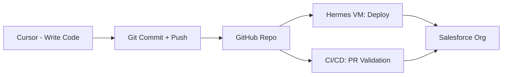

# Cursor + Salesforce Setup Guide

## Option A: Local Development (recommended)

Work in Cursor on your Windows laptop, push to GitHub, and let the VM/CICD handle deployment.

### 1. Install Salesforce Tooling in Cursor
```bash
# Install Salesforce CLI on Windows (PowerShell as admin)
npm install @salesforce/cli --location=global

# Install Salesforce extensions in Cursor
cursor install-extension salesforcedx-vscode.salesforcedx-vscode
```

### 2. Clone the Project
```bash
git clone https://github.com/chicken-tights-labs/sf-headless-crm.git
cd sf-headless-crm
code .
```

### 3. Open in Cursor
- Folder → Open Folder → `sf-headless-crm`
- Cursor auto-detects `sfdx-project.json` and activates Salesforce extensions

### 4. Connect to Your Org (once you have Partner Dev Org credentials)
```bash
sf org login web --alias partner-dev --set-default --instance-url https://test.salesforce.com
```
Or with username/password:
```bash
sf org login user --alias partner-dev --set-default --instance-url https://test.salesforce.com --username YOUR_USERNAME
```

## Option B: Remote Development (via SSH to VM)

Connect Cursor directly to your Google Cloud VM.

### 1. SSH Setup (on your Windows laptop)
Add this to `~/.ssh/config` on your laptop:
```
Host sf-dev
    HostName 166.78.69.218
    User maria_robbins
    IdentityFile ~/.ssh/google_compute_engine
    ForwardAgent yes
```

### 2. Install Remote SSH Extension
```bash
cursor install-extension ms-vscode-remote.remote-ssh
```

### 3. Connect
- Ctrl+Shift+P → "Remote-SSH: Connect to Host"
- Select `sf-dev`
- Open `/home/maria_robbins/sf-project/sf-headless-practice`

## Cursor Development Workflow



1. Write Apex classes, LWC components, or metadata XML in Cursor
2. `git add . && git commit -m "feat: ..."`
3. `git push origin main` (or open a PR)
4. GitHub Actions runs CI checks automatically
5. Hermes VM pulls and deploys to the Partner Dev Org

## Salesforce-Specific Cursor Settings (already configured)
- File associations for `.object-meta.xml`, `.field-meta.xml`, etc.
- Format on save enabled
- Salesforce DX extensions auto-activated
