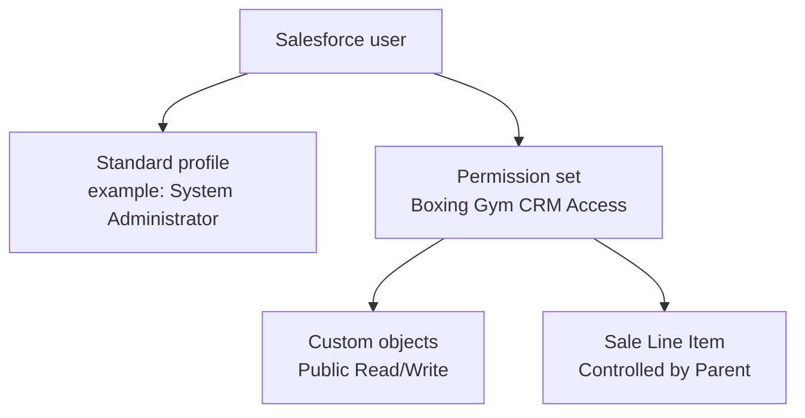

# EPIC-11 / US-D004 — System Admin Guide

Issue: #40. Kanban: `t_7b14be8b`.

**Status:** Draft
**Last verified:** 2026-10-08 against `main` `23d6c67`
**Checked from:** source in `force-app` (not an org click-through)
**Still open:** screenshots in `my-gym`; Apex class access and Referral Reward tab are gaps, not finished admin features; Obsidian copy

This is the canonical copy. The issue names `CRM-Documentation/EPIC-11_D004_System_Admin_Guide.md`. Sync that vault from this file when the vault is available. Do not edit the two copies separately.

Setup click-paths below are standard Lightning Setup. Confirm them in the org before treating this as finished.

## Who this is for

A system administrator who creates users, assigns access, and keeps gym records (locations, waiver templates, membership tiers) consistent with source.

Daily trainer and front-desk work is US-D001. Manager reports are US-D002. API setup is US-D005.

## What you see in the app

The Lightning app is **Boxing Gym CRM** (`Boxing_Gym_CRM`). Open it from the App Launcher.

The app navigation shows:

| Tab | Object |
|---|---|
| Home | Gym Manager Home page |
| Members | `Member__c` |
| Scheduled Sessions | `Scheduled_Session__c` |
| Bookings | `Booking__c` |
| Leads | `Lead__c` |
| Franchise Locations | `Franchise_Location__c` |
| Waiver Records | `Waiver_Record__c` |
| Payment Transactions | `Payment_Transaction__c` |
| Reports | standard |
| Dashboards | standard |

These tabs are granted by the permission set but are **not** on the app bar. Open them from the App Launcher:

Franchise Owners, Waiver Templates, Default Class Templates, Inventory Items, Product Categories, Merchandise Sales, Sale Line Items, Royalty Reports.

**Referral Rewards** has no tab in the permission set. See the gap under Permissions.

## Security model

There is one custom permission set and no custom profiles, roles, or sharing rules in source.



| Layer | What is in source |
|---|---|
| Profile | None. Use a standard Salesforce profile. The scratch-org admin uses System Administrator. |
| Permission set | `Boxing_Gym_CRM_Access`, label **Boxing Gym CRM Access**. Not activation-required. |
| Role | None. |
| Org-wide default | `ReadWrite` (Public Read/Write) on every custom object except `Sale_Line_Item__c`, which is `ControlledByParent`. |
| Sharing rules | None. |
| Field-level security | Every field listed in the permission set is readable and editable. |

`Boxing Gym CRM Access` grants Create, Read, Edit, Delete, View All, and Modify All on these objects:

Franchise Owner, Franchise Location, Waiver Template, Lead, Member, Booking, Default Class Template, Scheduled Session, Sale Line Item, Merchandise Sale, Payment Transaction, Product Category, Royalty Report, Inventory Item, Waiver Record.

It also makes those objects' tabs Visible, except Referral Reward.

### Why the permission set is required

Deployed custom fields get **no** field-level security, including for System Administrator. A fresh scratch org admin can deploy metadata and still see blank custom fields until **Boxing Gym CRM Access** is assigned.

After every scratch org create:

```bash
sf org assign permset --target-org my-gym --name Boxing_Gym_CRM_Access
```

In the UI: Setup → Permission Sets → **Boxing Gym CRM Access** → Manage Assignments → Add Assignments.

### Gaps in the permission set

- **No Apex class access.** The set does not list any class. Before go-live, grant `EPIC01_LeadCapture_Rest` to the integration user (profile or a permission set). Screen actions such as Convert to Member call Apex; a user who is not a System Administrator needs class access added in source before those buttons work for them.
- **No Flow access entries.** The set does not name any Flow.
- **Referral Reward** (`Referral_Reward__c`) has field permissions only. It has no object permission and no tab. Users will not get a normal Referral Rewards tab from this set. Rewards are created by the referral Apex, not by a screen in this guide.

Do not "fix" those gaps only in the org. Add them to `force-app/main/default/permissionsets/Boxing_Gym_CRM_Access.permissionset-meta.xml` and deploy, or the next scratch org will miss them again.

## User management

### Create a user

1. Setup (gear) → **Users** → **Users**.
2. **New User**.
3. Fill **First Name**, **Last Name**, **Email**, **Username** (must be unique across Salesforce, usually an email-shaped value), and **Nickname**.
4. **User License**: Salesforce (or the license your org actually has). This repo does not define a license type.
5. **Profile**: a standard profile that may use Lightning. For the scratch and dev admin, that is **System Administrator**. This project does not ship a Trainer, Front Desk, or Manager profile.
6. Save.
7. Assign **Boxing Gym CRM Access** (see above). Without it, custom fields stay invisible.
8. Confirm the user can open the **Boxing Gym CRM** app from the App Launcher.

### Deactivate a user

1. Setup → Users → Users.
2. Open the user.
3. **Edit**.
4. Clear **Active**.
5. Save.

Deactivated users cannot log in. Their records stay. This project has no freeze, anonymize, or license-transfer automation.

### Reset a password

1. Setup → Users → Users.
2. Open the user.
3. **Reset Password**. Salesforce emails a reset link to the address on the user record.

You cannot set the password to a chosen value from this guide. Scratch-org login from the laptop is a separate problem: OTP links are bound to the VM. Use `sf org generate password --target-org my-gym` when you need a password for that org. See `docs/environment.md`.

### Roles

There is nothing to assign. Setup → Roles will not show a gym role hierarchy from this project. Access is the profile plus **Boxing Gym CRM Access**, which is full access to the CRM objects (View All and Modify All). It is not a least-privilege trainer or front-desk set.

## Permissions and security

### Permission set architecture

One set does all CRM access. It is not split by trainer, front desk, manager, or franchise owner.

| File | API name | Label |
|---|---|---|
| `force-app/main/default/permissionsets/Boxing_Gym_CRM_Access.permissionset-meta.xml` | `Boxing_Gym_CRM_Access` | Boxing Gym CRM Access |

### Field-level security

1. Setup → Permission Sets → **Boxing Gym CRM Access** → Object Settings.
2. Open an object → **Edit**.
3. Field permissions show Read and Edit checked for the fields in source.

If a new field is missing here, it was deployed without a `<fieldPermissions>` entry. Add that entry in Git and redeploy. Checking the box only in Setup will not survive the next scratch org.

System Administrator does not bypass this. FLS still has to be granted.

### Org-wide defaults

1. Setup → **Sharing Settings**.
2. Under **Default Internal Access**, each custom object from this project should be **Public Read/Write**, except **Sale Line Item**, which should be **Controlled by Parent** (parent is Merchandise Sale).

That matches `<sharingModel>` on each object. Change it in the object metadata and deploy. An org-only change drifts from Git.

Because the permission set also has View All and Modify All, assigned users can see and edit every record of those objects even if you later tighten the org-wide default. Tightening sharing only works if View All and Modify All are removed in source too.

### Sharing rules

None are in source. Setup → Sharing Settings should show no custom sharing rules for these objects. Do not add rules only in the org.

## System configuration

Schema and automation live in Git (`force-app`). The org is a deploy target.

To add or change an object or field:

1. Edit the metadata under `force-app/main/default/objects/`.
2. If the field should be visible, add `<fieldPermissions>` (readable and editable) to `Boxing_Gym_CRM_Access`.
3. Open a pull request. Do not commit straight to `main`.
4. After merge, deploy with the test gate in `docs/WORKFLOW.md`.
5. Re-assign the permission set on any org that does not have it yet.

Setup → Object Manager is useful for reading labels. It is the wrong place to invent fields you want to keep.

### Membership tiers

`Member__c.Membership_Tier__c` is a restricted picklist. Payment logic matches these **exact** values in `EPIC01_MemberOnboarding_Service`:

| Picklist value | What payment does |
|---|---|
| Monthly Unlimited ($129) | Start date today, expiry in 30 days. Payment type Monthly Fee. |
| Annual Prepaid ($99/mo) | Start date today, expiry in 365 days. Payment type Annual Prepayment. |
| Drop-In ($20/class) | Start and expiry stay empty. Payment type Drop-In Fee. |
| Punch Card (10 classes - $150) | Start date today, expiry in 180 days, Classes Remaining set to 10. Payment type Punch Card Top-Up. |

The dollar amounts in the labels are not a price book. Staff still type the amount on the payment action. Renaming a value only in Setup breaks payment, welcome email, and referral checks, because Apex compares the full string.

To change a tier:

1. Change the picklist value in `Member__c/fields/Membership_Tier__c.field-meta.xml`.
2. Change the matching constant in `EPIC01_MemberOnboarding_Service.cls` (`TIER_MONTHLY`, `TIER_ANNUAL`, `TIER_DROPIN`, `TIER_PUNCH`) and any other class that compares the same string.
3. Update tests that insert that value.
4. Deploy through a pull request.

There is an inactive picklist entry whose API name is `Membership_Tier__c`. Leave it inactive. Do not select it.

### Waiver templates

Waiver templates are **records**, not setup metadata. Age-based template selection is not built. Staff (or a waiver record) point at a template by lookup.

Create one from the App Launcher → **Waiver Templates** → **New**.

| Field on screen | Required | Notes |
|---|---|---|
| Waiver Template Name | Yes | Text name. Tests use "General Liability Waiver - Fencing & Boxing". |
| Template Type | Yes | Use **Adult**, **Minor**, or **Visitor**. A leftover value labeled `Template_Type__c` is also active. Do not select it. |
| Content Document | Yes | Text field (`Content_Version_Id__c`), up to 255 characters. It stores an id string. There is no file-upload automation in source. |
| Effective Date | Yes | Date the template starts. |
| Expiry Date | No | |
| Minimum Age | No | Number. Nothing in Apex reads it. |
| Is Current | No | Checkbox, default unchecked. Nothing enforces a single current template. |

A signed waiver is a **Waiver Record** that looks up to a template, a member or lead, and a franchise location. Booking and payment gates care about a valid signed waiver record, not about which template type you picked.

### Location records

Leads require a franchise location. Create the owner first, then the location.

**Franchise Owner** (App Launcher → Franchise Owners → New):

| Field | Required |
|---|---|
| Franchise Owner Name | Yes |
| Legal Name | Yes |
| Contact First Name | Yes |
| Contact Last Name | Yes |
| Email | Yes |
| Phone | No |
| Tax ID | No |
| Agreement Start Date | No |
| Agreement End Date | No |
| Payment Terms | No |
| Royalty Rate % | No. Whole-number percent. No royalty calculation runs from this field yet. |

**Franchise Location** (app tab Franchise Locations → New):

| Field | Required |
|---|---|
| Franchise Location Name | Yes. Lead capture can find a location by this name. |
| Franchise Owner | Yes. Lookup to the owner you just saved. |
| Status | Yes. Use **Active**, **Inactive**, or **Coming Soon**. Do not select the leftover value `Status__c`. |
| Corporate Owned | No. Checkbox, default unchecked. |
| Phone, Contact Email, Website | No |
| Billing Contact | No |
| Hours Mon-Fri, Hours Saturday, Hours Sunday | No |
| Active Members | No. A plain number. It does not count members for you. |

## What this guide does not cover

- Trainer, front desk, manager, and franchise-owner permission splits. They do not exist yet.
- Password policies, SSO, and connected-app setup. Connected-app creation is blocked in the Dev Hub; see `docs/environment.md`.
- API authentication. That is US-D005. The only REST path in source today is `POST /services/apexrest/leadcapture`.
- Annotated screenshots. Confirm the Setup pages above in `my-gym` and add images in a follow-up if you want them in the Obsidian copy.

## How to verify

1. In an org that has this project deployed, Setup → Permission Sets shows **Boxing Gym CRM Access**.
2. A user with that set can open **Boxing Gym CRM** and see Members, Leads, and Franchise Locations.
3. A user without that set does not see custom field values, even as System Administrator, until the set is assigned.
4. Setup → Sharing Settings shows Public Read/Write for Member, and Controlled by Parent for Sale Line Item.
5. You can create a Franchise Owner, then a Franchise Location with Status **Active**, then a Waiver Template with Template Type **Adult**, Content Document filled in, and Effective Date set.
6. Membership Tier on a member offers the four values in the table above, and those strings match `EPIC01_MemberOnboarding_Service`.
