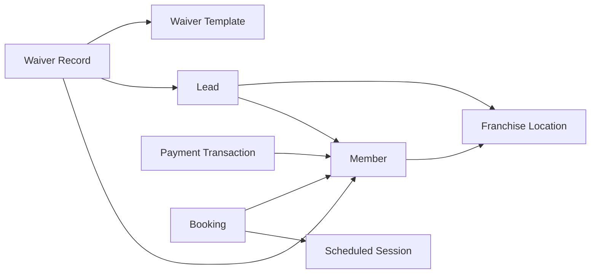

# EPIC-11 / US-D005 — API Documentation (POS Integration)

Issue: #41. Kanban: `t_24523042`.

**Status:** Draft
**Last verified:** 2026-10-08 against `main` `23d6c67`
**Checked from:** source in `force-app` (not an org click-through)
**Still open:** no OAuth client in source; no POS endpoints except lead capture; no Postman collection; class access for `EPIC01_LeadCapture_Rest` is not in the permission set

This is the canonical copy. The issue names `CRM-Documentation/EPIC-11_D005_API_Documentation.md`. Sync that vault from this file when the vault is available.

Staff screens for the same lead are US-D001. Users and the permission set are US-D004.

## Authentication

**Not built** as a custom OAuth flow. The one endpoint is Salesforce Apex REST. The caller sends a Salesforce access token. This repo does not mint, refresh, or expire tokens, and it does not define a rate limit.

`docs/environment.md` records that connected-app creation is blocked in the Dev Hub. There is no connected app in `force-app`.

Call shape:

```http
POST /services/apexrest/leadcapture
Authorization: Bearer {Salesforce access token}
Content-Type: application/json
```

Use the org's My Domain host. A token without access to `EPIC01_LeadCapture_Rest` will be rejected by Salesforce before this class runs. The permission set **Boxing Gym CRM Access** does not grant that class. Add class access in source before an integration user can call it.

## Lead registration

**Verified from source.** `EPIC01_LeadCapture_Rest` → `EPIC01_LeadCapture_Service.capture`.

Why Apex: a Flow cannot expose an inbound REST endpoint.

### Request body

| JSON field | Required | Notes |
|---|---|---|
| firstName | Yes | `First Name is required` |
| lastName | Yes | `Last Name is required` |
| email | No | If present, must look like an email. `Please enter a valid email address` |
| phone | No | If present, 10 digits after removing spaces, dashes, parentheses, dots, and a leading `+1`. `Please enter a valid 10-digit phone number` |
| leadSource | No | Defaults to `Web Form`. Other values used in source: `Walk-in`, `Facebook Ad`. Must be an active Lead Source value. |
| programInterest | No | Restricted picklist when set. |
| referralCode | No | Stored on `Referral_Code_Entered__c`. A before-save flow attributes a valid code. |
| franchiseLocationId | One of these two | Salesforce Id of a Franchise Location. |
| franchiseLocationName | One of these two | Name of a Franchise Location whose Status is **Active**. |
| campaignMetadata | No | Long text. Used for a raw Facebook payload. |

Example:

```json
{
  "firstName": "Maya",
  "lastName": "Rodriguez",
  "email": "maya.rodriguez@email.com",
  "phone": "336-555-0199",
  "leadSource": "Web Form",
  "programInterest": "Boxing",
  "referralCode": "SAM0KA00",
  "franchiseLocationName": "Lexington HQ",
  "campaignMetadata": "{}"
}
```

The location name in the example must already exist and be Active. This repo does not seed Lexington HQ.

### Response body

```json
{
  "success": true,
  "leadId": "a00...",
  "message": "Lead created",
  "duplicate": false,
  "errors": []
}
```

| HTTP status | When | message |
|---|---|---|
| 201 | Lead inserted | `Lead created` |
| 409 | Same email already on a Lead | `Lead already exists — redirecting to update flow`. `duplicate` is true. `leadId` is the existing lead. There is no update API behind that sentence. |
| 400 | Validation, unknown location, or a save error | Joined validation messages, or `A valid franchise location is required`, or the DML message. |
| 400 | Body is not JSON of that shape | `Invalid request body` |

Duplicate detection is email only. Phone is not checked for duplicates.

Side effects after a successful insert, not in the JSON:

- Valid `referralCode` sets Referred By and Lead Source Referral, and the referral program counts an attempt.
- Invalid code leaves Referred By blank and writes the warning on Notes.
- The web form host, the trainer app, and the Facebook webhook relay are not in this repo. They would call this URL.

## POS endpoints that are not built

**Not built.** Do not call these paths. They are not in source.

- Lead-to-member conversion
- Payment processing
- Membership renewal
- Merchandise sale
- Discount application
- Refund / return

Conversion and payment exist as record quick actions in the CRM (US-D001), not as REST.

## Objects a caller will meet

**Verified from source** as names and relationships. Field-by-field lists live under `force-app/main/default/objects/`. Required-field rules for the REST call are the table above, not every object.



`Referral_Reward__c` links a referring member, a referred lead, and a referred member. The lead-capture API does not accept reward fields. The referral flow creates the reward after insert.

## Errors and retries

**Verified from source** for this endpoint only.

| Situation | Retry |
|---|---|
| 400 validation or location | Fix the body. Retrying the same body fails again. |
| 409 duplicate email | Do not insert again. The response already returns the existing `leadId`. There is no PATCH. |
| 400 `Invalid request body` | Send JSON that deserializes to the request fields. |
| Salesforce auth failure | Token problem, outside this class. |
| Rate limit | Not implemented here. Salesforce platform limits still apply. |

## How to verify this draft

1. `force-app` contains `@RestResource(urlMapping='/leadcapture/*')` and no other `urlMapping`.
2. A call with a real token, a real Active location, and a new email returns 201 and `Lead created`.
3. The same email returns 409.
4. Leave the other POS paths on **Still open** until a class exposes them.
