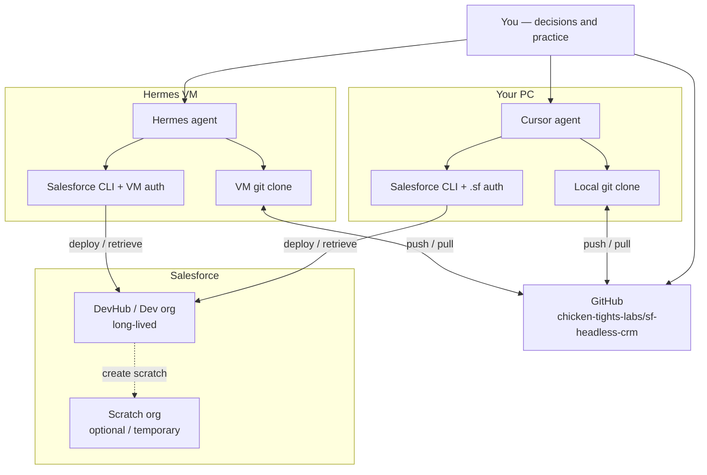

# 00 — Overview: Your toolchain map

Visual + hands-on guide for developing **sf-headless-crm** with Cursor, Hermes, GitHub, and Salesforce.

**Your real names (bookmark these):**

| Thing | Value |
|-------|--------|
| GitHub repo | `chicken-tights-labs/sf-headless-crm` |
| Local folder (Cursor / PC) | `C:\Users\maria\Documents\sf-headless-crm` |
| Hermes path (typical) | `sf-project/sf-headless-crm/` on the VM |
| Org alias on this PC | `chickentightslabs` |
| Org alias often used on Hermes | `my-gym` (same org possible; **different alias**) |

---

## Big picture



**One rule to remember:** Cursor and Hermes do **not** share a disk. They only stay in sync when both have pulled the **same GitHub commit**.

---

## What each piece is for

| Piece | Job | Think of it as… |
|-------|-----|-----------------|
| **GitHub** | Source of truth for files | The shared notebook |
| **Cursor (PC)** | Edit + explore + run commands locally | Your desk |
| **Hermes (VM)** | Long agent runs / remote `sf` + git | A second desk in another room |
| **DevHub / Dev org** | Long-lived Salesforce environment | The real workshop |
| **Scratch org** | Short-lived throwaway org | A temporary workbench |

---

## Glossary

| Term | Meaning |
|------|---------|
| **Commit / SHA** | Fingerprint of an exact set of files (e.g. `8715b71`). Same SHA ⇒ same files. |
| **Branch** | A line of commits (you usually work on `main` or a feature branch). |
| **Push / pull** | Send your commits to GitHub / download GitHub’s commits to a machine. |
| **Org alias** | Local nickname for a Salesforce login (`chickentightslabs`, `my-gym`). **Per machine.** |
| **DevHub** | Org allowed to create scratch orgs; often also your default long-lived org. |
| **Scratch org** | Disposable Salesforce org that expires; great for safe experiments. |
| **Deploy** | Push local metadata (`force-app/…`) **into** an org. |
| **Retrieve** | Pull metadata **from** an org into your local project. |
| **Metadata** | Salesforce config/code as XML/Apex under `force-app/` (objects, fields, classes, …). |

---

## Try this now (2 minutes)

In PowerShell, from your project folder:

```powershell
cd C:\Users\maria\Documents\sf-headless-crm
git log -1 --oneline
sf org list
```

**Expected:**

- A recent commit line (EPIC-01 or later)
- Org list showing **`chickentightslabs`** as Connected (and default)

---

## What to read next

1. [01 — GitHub is the bridge](01-github-is-the-bridge.md)  
2. [02 — Salesforce orgs](02-salesforce-orgs.md)  
3. [03 — Deploy / retrieve loop](03-deploy-retrieve-loop.md)  
4. [04 — Cursor ↔ Hermes handoff](04-handoff-cursor-hermes.md)  
5. [PRACTICE — drills](PRACTICE.md)  

Skills and Automations come **later** — this pack is for learning by reading and doing only.
