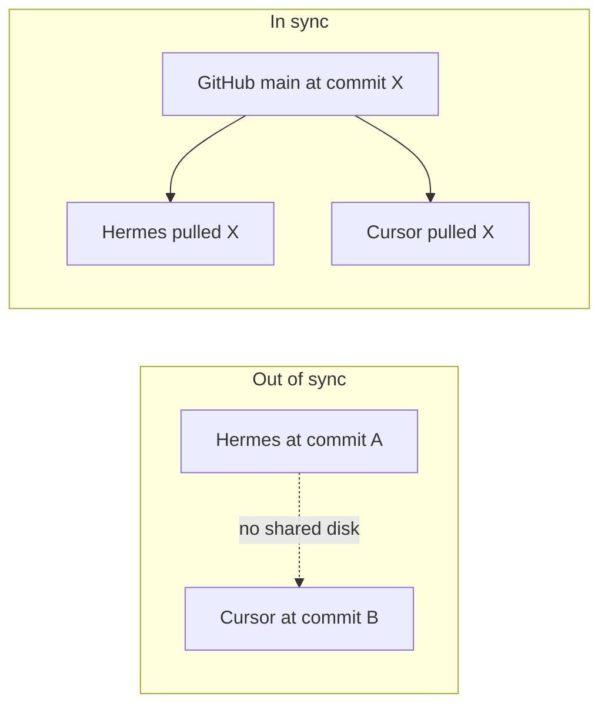

# 01 — GitHub is the bridge

Cursor (your PC) and Hermes (the VM) only share work through **GitHub**. If one side has newer files that were never pushed, the other side cannot see them.

---

## Visual: same commit = same files



**Release-engineer habit:** before you ask either agent to “continue EPIC work,” compare SHAs.

---

## Try this now — prove what this machine has

```powershell
cd C:\Users\maria\Documents\sf-headless-crm

# Are you clean and tracking origin/main?
git status -sb

# Exact commit fingerprint
git log -1 --format="%H %s"

# Short form (easier to say out loud / paste to Hermes)
git log -1 --oneline

# What does GitHub say main is?
git fetch origin
git log -1 --oneline origin/main
```

**How to read the result:**

| Situation | Meaning | What to do |
|-----------|---------|------------|
| `main...origin/main` and SHAs match | In sync with GitHub | Safe to develop |
| `behind N` | GitHub (or Hermes push) is ahead | `git pull` |
| `ahead N` | You have local commits not on GitHub | Push when ready (or discard if accidental) |
| Modified files in `git status` | Local edits not committed | Commit, stash, or discard before pull |

---

## Hands-on: pull so Cursor matches GitHub

Only when `git status` is clean (or you intentionally discard local junk):

```powershell
git pull --ff-only origin main
git log -1 --oneline
```

Then confirm EPIC-01 files exist (example checks):

```powershell
Test-Path .\force-app\main\default\classes\EPIC01_MemberOnboarding_Service.cls
Test-Path .\force-app\main\default\objects\Referral_Reward__c\Referral_Reward__c.object-meta.xml
```

Both should print `True` when you’re on the EPIC-01 scaffold commit (or later).

---

## Hands-on: compare with Hermes

On Hermes (or ask Hermes):

```bash
git log -1 --oneline
```

On Cursor PC:

```powershell
git log -1 --oneline
```

**If the short SHAs match** → you’re on the same files.  
**If they don’t** → the machine that is behind should pull; the machine that is ahead should push (if those commits are meant to be shared).

---

## Common failure you already hit

Hermes had new fields / Apex / `Referral_Reward__c`, but Cursor was still on an older commit. GitHub eventually got the commits; Cursor pulled; then the files appeared here.

That is the intended workflow — not a bug in Cursor.

---

## Next

- [02 — Salesforce orgs](02-salesforce-orgs.md)  
- Or jump to [PRACTICE.md](PRACTICE.md) drills 1–2
