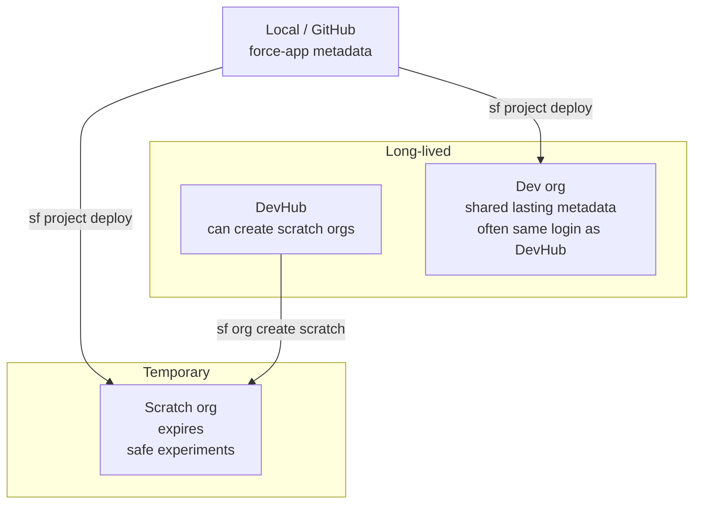
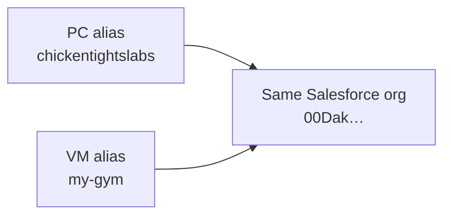

# 02 — Salesforce orgs (DevHub, Dev org, scratch)

Salesforce “environments” are separate clouds. Your **project files** live in Git; the **running CRM** lives in an org. You connect them with the Salesforce CLI (`sf`).

---

## Visual: which org for what



| Org type | Lifespan | Use when… |
|----------|----------|-----------|
| **DevHub** | Permanent | You need to create scratch orgs; hub for DX |
| **Dev org** | Permanent | Shared real metadata for the team / your lasting sandbox |
| **Scratch org** | Days (configurable) | Isolated deploy/test without polluting the Dev org |

On **this PC**, `sf org list` has shown **`chickentightslabs`** as both default org and DevHub (Connected).

---

## Critical: aliases are per machine



- Hermes may run: `sf project deploy start --target-org my-gym`
- This PC may need: `sf project deploy start --target-org chickentightslabs`

Both can point at the **same** org. The nickname is stored in local CLI auth (`.sf` / `.sfdx`), **not** in GitHub.

---

## Try this now

```powershell
cd C:\Users\maria\Documents\sf-headless-crm
sf org list
sf org display --target-org chickentightslabs
```

**Expected:**

- One Connected org with alias `chickentightslabs`
- `sf org display` shows username / org Id / instance URL

**If `my-gym` is missing here:** that is normal. Either:

1. Keep using `chickentightslabs` on this PC, or  
2. Log in and set an alias:

```powershell
sf org login web --alias my-gym --set-default
```

(Only do that when you intentionally want the `my-gym` name on this machine.)

---

## Scratch org (concept + when you’ll use it)

Scratch orgs are created **from** a DevHub using a definition file (`config/project-scratch-def.json` in this repo).

Typical flow (for later practice, not required today):

```powershell
# Create (needs DevHub auth)
sf org create scratch --definition-file config/project-scratch-def.json --alias practice-scratch --set-default --duration-days 7

# Deploy into it
sf project deploy start --target-org practice-scratch

# When done
sf org delete scratch --target-org practice-scratch --no-prompt
```

**Why bother?** Deploy EPIC Apex/tests safely; if something breaks, delete the scratch and start over. Your Dev org stays clean.

---

## Mental model

```text
GitHub  =  what the code/metadata SHOULD be
Org     =  what Salesforce IS running right now

Deploy   →  make org match your files
Retrieve →  make your files match the org
```

Prefer **GitHub as truth**, then deploy. Only retrieve when the org was changed in the UI and you need those changes in source.

---

## Next

- [03 — Deploy / retrieve loop](03-deploy-retrieve-loop.md)  
- [PRACTICE.md](PRACTICE.md) drill 3
