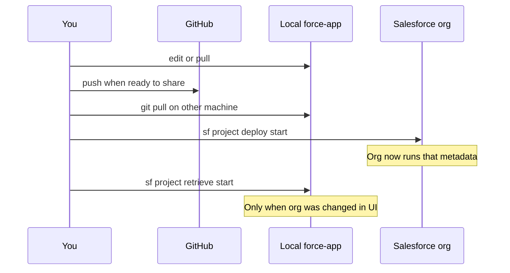

# 03 — Deploy / retrieve loop

Move metadata between your **local project** (and GitHub) and a **Salesforce org**.

---

## Visual: the happy path



---

## Cheat sheet (this PC)

Replace nothing if you stay with the default alias:

```powershell
cd C:\Users\maria\Documents\sf-headless-crm

# Who am I deploying to?
sf org list

# Preview deploy (validates; does not commit changes to the org)
sf project deploy start --target-org chickentightslabs --dry-run

# Real deploy (writes to the org)
sf project deploy start --target-org chickentightslabs

# Deploy one folder (example: Apex only)
sf project deploy start --source-dir force-app/main/default/classes --target-org chickentightslabs

# Run EPIC-01 tests after Apex is in the org
sf apex run test --target-org chickentightslabs -n EPIC01_MemberOnboarding_Test --result-format human --wait 10
```

If Hermes docs say `--target-org my-gym`, on this PC use **`chickentightslabs`** unless you created the `my-gym` alias locally.

---

## Try this now — dry-run only (safe)

A dry-run checks whether the org would accept your metadata. It does **not** permanently apply the change the same way a full deploy does (still talk to Salesforce; use when you’re ready to practice).

```powershell
cd C:\Users\maria\Documents\sf-headless-crm
git status -sb
sf project deploy start --target-org chickentightslabs --dry-run
```

**How to read the output:**

| Result | Meaning |
|--------|---------|
| Succeeded | Metadata shape looks acceptable to the org |
| Component failures | Specific XML/Apex issues — open the listed file/line |
| Auth / invalid org | Re-login: `sf org login web --alias chickentightslabs --set-default` |

When you’re confident, drop `--dry-run` for a real deploy.

---

## Retrieve (use sparingly)

```powershell
# Example: pull one object from the org into source
sf project retrieve start --metadata CustomObject:Member__c --target-org chickentightslabs
```

After retrieve: review `git diff`, commit only what you intend to keep as source of truth.

---

## EPIC-01 files you’ll deploy eventually

| Path | Role |
|------|------|
| `force-app/main/default/objects/...` new fields | Schema for Lead / Member / Payment / Waiver |
| `force-app/main/default/objects/Referral_Reward__c/` | New object |
| `force-app/main/default/classes/EPIC01_MemberOnboarding_Service.cls` | Service skeleton |
| `force-app/main/default/classes/EPIC01_MemberOnboarding_Test.cls` | Test scaffold |
| `force-app/main/default/permissionsets/Boxing_Gym_CRM_Access.permissionset-meta.xml` | Field access |

Order of confidence: **pull GitHub → dry-run → deploy → run tests**.

---

## Next

- [04 — Cursor ↔ Hermes handoff](04-handoff-cursor-hermes.md)  
- [PRACTICE.md](PRACTICE.md) drills 4–5
