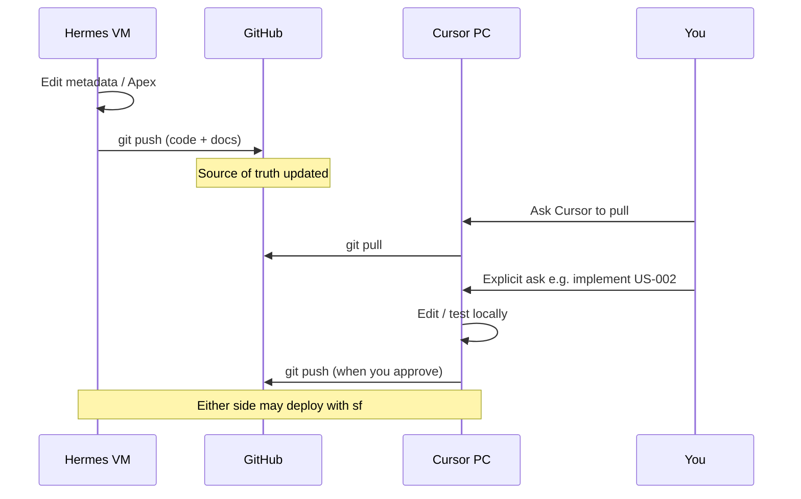

# 04 — Cursor ↔ Hermes handoff

How work moves between the two agents **without** Skills or Automations (those can come later).

---

## Visual: handoff sequence



---

## The three payloads of a good handoff

1. **Code** — commits on GitHub (`force-app/…`)  
2. **Context** — README / ARCHITECTURE / EPIC notes (what’s done, what’s next)  
3. **A human (or chat) trigger** — “Pull, then implement US-002”

Cursor does **not** auto-wake when Hermes pushes. You open a chat and say what to do after pull.

---

## Try this now — practice a handoff script

### On Hermes (or ask Hermes)

1. Confirm SHA: `git log -1 --oneline`  
2. Confirm pushed: status clean vs `origin/main`  
3. Leave a clear “next step” in a doc Hermes already updates (README Next Steps is fine for now)

### On Cursor PC

```powershell
cd C:\Users\maria\Documents\sf-headless-crm
git fetch origin
git log -1 --oneline HEAD
git log -1 --oneline origin/main
git pull --ff-only origin main
```

Then in Cursor chat, be explicit, for example:

> Pull is done. Read the EPIC-01 source map in README and implement the next Logic ⏳ user story. Don’t create Skills.

---

## Who deploys?

Either machine can deploy **if** it has CLI auth to that org.

| Machine | Typical alias | Command shape |
|---------|---------------|---------------|
| Hermes | `my-gym` | `sf project deploy start --target-org my-gym` |
| Cursor PC | `chickentightslabs` | `sf project deploy start --target-org chickentightslabs` |

Agree who deploys so you don’t double-deploy conflicting local edits. Prefer: **push → pull on the other side → one deploy**.

---

## Future peek (do not set up yet)

Later you *can* add:

- A `NEXT.md` checklist Hermes updates on every push  
- Cursor **Automations** that run when GitHub gets a push/PR  
- Cursor **Skills** for repeated Salesforce steps  

Those amplify the same pattern. They are optional; this pack teaches the manual loop first.

---

## Next

- [PRACTICE.md](PRACTICE.md) — do the drills in order  
- Return to [00 — Overview](00-overview.md) anytime you need the map
